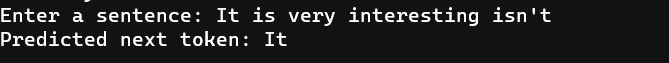

# vAI NLP model
AI repo for C++ users

`1` ` ail.cpp `
> **ail.cpp** : NLP model (Transformer & adamw optimizer)  
>  [go to ail.cpp](ail.cpp) Lastest version : 1.0.4
>  
> 

## TODO  
- Increase the datasets to more than 4096 tokens
- Modularization
- Normalization
- Optimization  

## Discord Server
https://discord.gg/jmKv62wSUc
